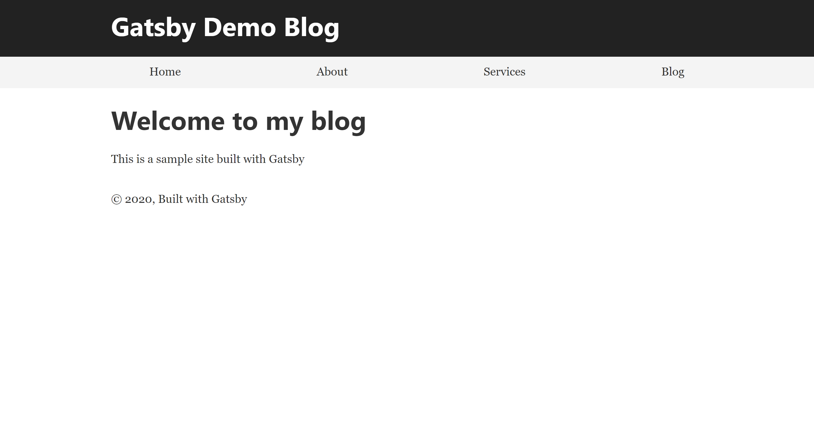
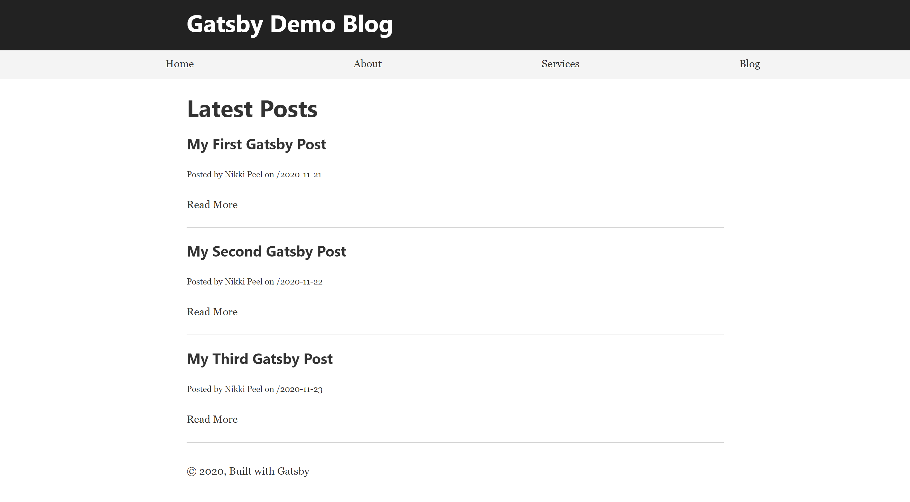
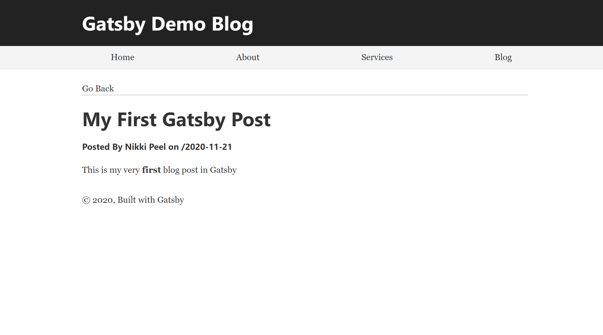

<h1>Gatsby Blog </h1>

*Very simple blog built with GatsbyJS*
  - Blog posts created with markdown files
  - Post pages displayed using GraphQL queries

Features to add:
  - Style using TailwindCSS
  - Add in Sanity CMS

<h2>- Home Page -</h2>
  

<h2>- Blog Page -</h2>
  

<h2>- Single Post Page -</h2>
  
