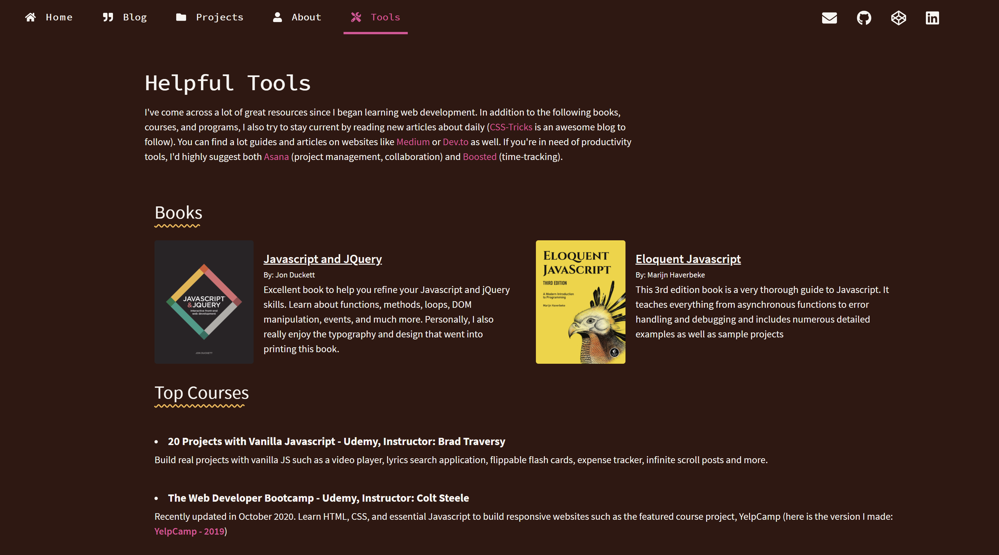

<h1>Markdown Blog w/Gatsby </h1>

*Technical blog built with Markdown and GatsbyJS*
  - Blog posts created with markdown files
  - Post pages and frontmatter displayed using GraphQL queries
  - Image optimization with gatsby-image

<h2>- Homepage -</h2>
  
  

<h2>- Blog -</h2>
  

<h2>- Single Post -</h2>
    

<h2>- Projects  -</h2>
  

<h2>- Resources -</h2>
  

<h2>- Fixed Bottom Navigation (small screens)-</h2>
  
